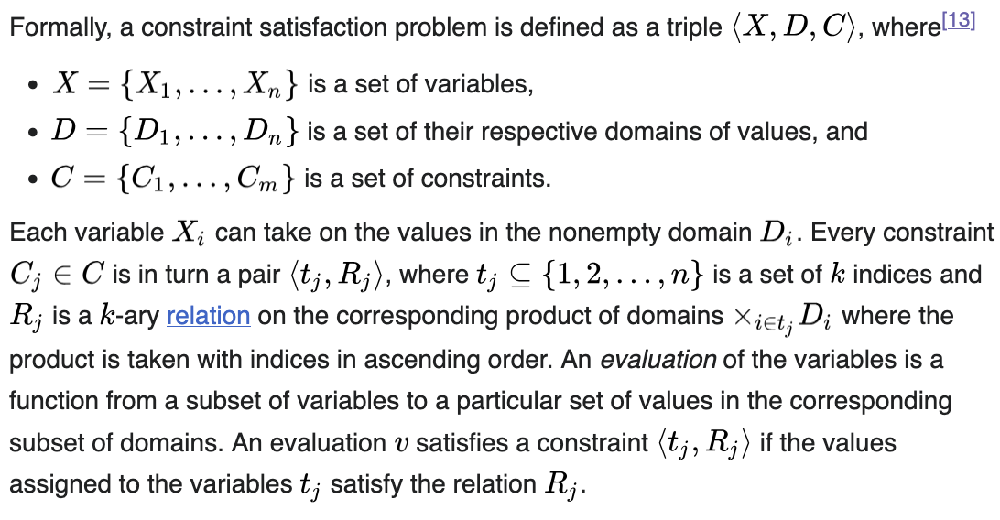

# Solving Easy Problems with Constraint Solvers

---
##  Motivation

- Task: Build a Philadelphia Film Festival schedule of maximum movie viewing 🎥
- Computers could probably help with this 💻
- I don't know where to begin when it comes to data modeling 😵‍💫
- I've heard of this "constraint programming" thing 🤔

---
##  Agenda

- Constraint Solvers
- (at a little `itertools` along the way)

Examples:

- Sudoku
- Film Festival
- Optimized Film Festival 

---
## Constraint Solvers

> "In constraint programming, users declaratively state the constraints on the feasible solutions for a set of decision variables."

General pattern is:

* set up variables*
* set up constraints on those variables
* run the solver and generate a solution or solutions

---
## Constraint Solvers: Variables

* not your standard programming language variable like 

```
my_string = "Hello World!"
```

* they represent the unknown information in a problem
* examples we'll see later:
  * a sudoku cell `r0c0` can have some value `1..9`
  * `will_attend_<showtime>` is a boolean variable

^ https://www.ibm.com/docs/en/icos/22.1.2?topic=model-decision-variables

---
## Constraint Solvers: Constraints

* places limits on the values a variable or variables can take
* examples we'll see later:
  * "each cell in a sudoku row should be unique"
  * "I only want to see one showing of movie"

^ without constraints, you'd get things like a sudoku puzzle solution of all 9s

---
## Constraint Solvers: Solve
* with a set of variables and constraints, the solver will do __Some Math™__ and generate possible solutions

---
## Constraint Solvers
- Things get complicated quickly

[.column: width(2)]


[.column: width(3)]

```
int: n_showings;
int: n_films;

array[1..n_showings] of int: film;
array[1..n_showings] of int: weight;
array[1..n_showings, 1..n_showings] of bool: conflicts;

array[1..n_showings] of var bool: attend;

constraint forall(f in 1..n_films)(
    sum(s in 1..n_showings where film[s] = f)(attend[s]) <= 1
);

constraint forall(s1, s2 in 1..n_showings where conflicts[s1, s2])(
    attend[s1] + attend[s2] <= 1
);

solve maximize sum(s in 1..n_showings)(weight[s] * attend[s]);
```

---
## Constraint Solvers
- Luckily, the good people at Google made a tool that is the most English looking


---
## Sudoku

---
## Sudoku: Variables

Set up variables: each square of our puzzle can have the value 1-9

```python
model = cp_model.CpModel()

puzzle = [
    [model.new_int_var(1, 9, f"r{row}c{col}") for col in range(9)]
    for row in range(9)
]
```

---
## Sudoku: Variables

```
(Pdb) pprint(puzzle)
[[r0c0(1..9), r0c1(1..9), ..., r0c8(1..9)],
 [r1c0(1..9), r1c1(1..9), ..., r1c8(1..9)],
 ...
 [r8c0(1..9), r8c1(1..9), ..., r8c8(1..9)]]
```
---
## Sudoku: Constraints

Set up constraints 

[.code-highlight: 1-3]
```python
# all of the values in a row should be different
for row in puzzle:
    model.add_all_different(row)

# all of the values in a column should be different
for col in zip(*puzzle):
    model.add_all_different(col)

# all of the values in each "box" should be different
bands = (0, 1, 2), (3, 4, 5), (6, 7, 8)
for rows, cols in product(bands, repeat=2):
    model.add_all_different([puzzle[row][col] for row, col in product(rows, cols)])
```

---
## Sudoku: Constraints

Set up constraints 

[.code-highlight: 5-7]
```python
# all of the values in a row should be different
for row in puzzle:
    model.add_all_different(row)

# all of the values in a column should be different
for col in zip(*puzzle):
    model.add_all_different(col)

# all of the values in each "box" should be different
bands = (0, 1, 2), (3, 4, 5), (6, 7, 8)
for rows, cols in product(bands, repeat=2):
    model.add_all_different([puzzle[row][col] for row, col in product(rows, cols)])
```

---
## Sudoku: Constraints

Set up constraints 

[.code-highlight: 9-12]
```python
# all of the values in a row should be different
for row in puzzle:
    model.add_all_different(row)

# all of the values in a column should be different
for col in zip(*puzzle):
    model.add_all_different(col)

# all of the values in each "box" should be different
bands = (0, 1, 2), (3, 4, 5), (6, 7, 8)
for rows, cols in product(bands, repeat=2):
    model.add_all_different([puzzle[row][col] for row, col in product(rows, cols)])
```

---
## Aside: product(bands, repeat=2)

`repeat=2` is shorthand for passing the same iterable twice — gives every (row_band, col_band) combination

```
>>> bands = (0, 1, 2), (3, 4, 5), (6, 7, 8)
>>> list(product(bands, repeat=2))
[((0, 1, 2), (0, 1, 2)),
 ((0, 1, 2), (3, 4, 5)),
 ((0, 1, 2), (6, 7, 8)),
 ((3, 4, 5), (0, 1, 2)),
 ((3, 4, 5), (3, 4, 5)),
 ((3, 4, 5), (6, 7, 8)),
 ((6, 7, 8), (0, 1, 2)),
 ((6, 7, 8), (3, 4, 5)),
 ((6, 7, 8), (6, 7, 8))]  # 9 boxes
```

---
## Aside: product(rows, cols)

`rows` and `cols` are already two different iterables — no `repeat` needed

```
>>> rows, cols = (0, 1, 2), (0, 1, 2)  # top-left box
>>> list(product(rows, cols))
[(0, 0), (0, 1), (0, 2),
 (1, 0), (1, 1), (1, 2),
 (2, 0), (2, 1), (2, 2)]  # 9 cells
```

---
## Sudoku: Constraints

Add real values to the model we set up

```python
"""
Puzzle_input something like
"...26.7.168..7..9.19...45..82.1...4...46.29...5...3.28..93...74.4..5..367.3.18..."
"""
for row_index, row_chars in enumerate(batched(puzzle_input, 9)):
    for col_index, char in enumerate(row_chars):
        if char.isdigit():
            model.add(puzzle[row_index][col_index] == int(char))
```

---
## Sudoku: Solve

Run the solver

```python
solver = cp_model.CpSolver()
solver.solve(model)

return "".join(
    str(solver.value(cell)) for cell in chain.from_iterable(puzzle)
)
```

---
```

solved_puzzle = solve(puzzle_input)

print("INPUT")
print_puzzle(puzzle_input)

print("SOLVED")
print_puzzle(solved_puzzle)
```
[.column]
```
INPUT
. . . | 2 6 . | 7 . 1
6 8 . | . 7 . | . 9 .
1 9 . | . . 4 | 5 . .
------+-------+------
8 2 . | 1 . . | . 4 .
. . 4 | 6 . 2 | 9 . .
. 5 . | . . 3 | . 2 8
------+-------+------
. . 9 | 3 . . | . 7 4
. 4 . | . 5 . | . 3 6
7 . 3 | . 1 8 | . . .
```
[.column]
```
SOLVED
4 3 5 | 2 6 9 | 7 8 1
6 8 2 | 5 7 1 | 4 9 3
1 9 7 | 8 3 4 | 5 6 2
------+-------+------
8 2 6 | 1 9 5 | 3 4 7
3 7 4 | 6 8 2 | 9 1 5
9 5 1 | 7 4 3 | 6 2 8
------+-------+------
5 1 9 | 3 2 6 | 8 7 4
2 4 8 | 9 5 7 | 1 3 6
7 6 3 | 4 1 8 | 2 5 9
```

---
## Film Festival


---
## Film Festival

```
> head -n 5 data/festival/showings.csv
title,start_dt,end_dt,theater,runtime_minutes
ALICE-HEART,2025-10-18 16:15:00,2025-10-18 17:48:00,Film Society Bourse,93
ALICE-HEART,2025-10-25 14:00:00,2025-10-25 15:33:00,Film Society East,93
ANIMATED SHORTS,2025-10-18 19:30:00,2025-10-18 21:02:00,Film Society East,92
ANIMATED SHORTS,2025-10-26 15:15:00,2025-10-26 16:47:00,Film Society East,92
```

---
## Film Festival: Data

```python
@dataclass(frozen=True)
class Film:
    title: str
    runtime_minutes: int


@dataclass(frozen=True)
class Showing:
    film: Film
    start_dt: datetime
    end_dt: datetime
    theater: str
```

---
## Film Festival: Variables

```python
model = cp_model.CpModel()

attend = {
    showing: model.new_bool_var(f"attend_{showing.film.title}_{showing.start_dt}")
    for showing in showings
}
```

---
## Film Festival: find_conflicts

[.column: width(1)]
```python
BUFFER_MINUTES = 10

THEATER_TRAVEL_MINUTES = {
    "Film Society East": {
        "Film Society Bourse": 8,
        "Film Society Center": 30,
        "Film Society East": 0,
    },
    "Film Society Bourse": {
        "Film Society East": 8,
        "Film Society Center": 25,
        "Film Society Bourse": 0,
    },
    "Film Society Center": {
        "Film Society East": 30,
        "Film Society Bourse": 25,
        "Film Society Center": 0,
    },
}
```

[.column: width(2)]
```python
def can_attend_both(one: Showing, other: Showing):
    earlier, later = sorted([one, other], key=lambda s: s.start_dt)
    travel_minutes = THEATER_TRAVEL_MINUTES[earlier.theater][later.theater]
    return (
        earlier.end_dt + timedelta(minutes=travel_minutes + BUFFER_MINUTES)
        <= later.start_dt
    )


def find_conflicts(showings):
    return [
        conflict
        for conflict in combinations(showings, 2)
        if not can_attend_both(*conflict)
    ]
```


---
## Film Festival: Constraints

[.code-highlight: 1-4]
```python
# attend exactly one showing per movie
showings_by_title = sorted(showings, key=lambda s: s.film.title)
for _, options in groupby(showings_by_title, key=lambda s: s.film.title):
    model.add_exactly_one([attend[s] for s in options])

# can't attend conflicting showings
for one, other in find_conflicts(showings):
    model.add_at_most_one([attend[one], attend[other]])
```

---
## Film Festival: Constraints

[.code-highlight: 6-8]
```python
# attend exactly one showing per movie
showings_by_title = sorted(showings, key=lambda s: s.film.title)
for _, options in groupby(showings_by_title, key=lambda s: s.film.title):
    model.add_exactly_one([attend[s] for s in options])

# can't attend conflicting showings
for one, other in find_conflicts(showings):
    model.add_at_most_one([attend[one], attend[other]])
```


---
## Film Festival

```
showings = load_showings(args.showings)
schedule = solve(showings)
print_schedule(schedule)
```

```
Feasible schedule:
Fri Oct 17 12:00 PM — 01:39 PM  | LIVE ACTION SHORTS  @ Film Society Bourse  (99m)
Fri Oct 17 06:45 PM — 08:30 PM  | NEVER GET BUSTED!  @ Film Society Bourse  (105m)
Sat Oct 18 04:15 PM — 05:48 PM  | ALICE-HEART  @ Film Society Bourse  (93m)
Sat Oct 18 09:30 PM — 11:20 PM  | BUTTHOLE SURFERS: THE HOLE TRUTH AND NOTHING BUTT  @ Film Society Bourse  (110m)
Sun Oct 19 02:45 PM — 04:53 PM  | H IS FOR HAWK  @ Film Society Bourse  (128m)
Mon Oct 20 08:15 PM — 10:02 PM  | FILMADELPHIA SHORTS  @ Film Society East  (107m)
Fri Oct 24 06:30 PM — 08:01 PM  | THE PYTHON HUNT  @ Film Society Bourse  (91m)
Sun Oct 26 03:15 PM — 04:47 PM  | ANIMATED SHORTS  @ Film Society East  (92m)
Sun Oct 26 06:30 PM — 08:01 PM  | WHAT THE HELL HAPPENED?  @ Film Society East  (91m)
```

---
## Film Festival
Problem: I had to manually edit my CSV through trial an error to remove movies until the solver could find a feasible schedule

---
## Film Festival Optimized

Solution:

* add a `weight` column to the CSV to score how much I want to see any movie
* add a `maximize` constraint to the model

---
## Film Festival Optimized: Data

```
> head -n 5 data/festival/ranked_showings.csv
weight,title,start_dt,end_dt,theater,runtime_minutes
25,ANIMATED SHORTS,2025-10-18 19:30:00,2025-10-18 21:02:00,Film Society East,92
25,ANIMATED SHORTS,2025-10-26 15:15:00,2025-10-26 16:47:00,Film Society East,92
24,WHAT THE HELL HAPPENED?,2025-10-18 19:00:00,2025-10-18 20:31:00,Film Society Bourse,91
24,WHAT THE HELL HAPPENED?,2025-10-25 18:30:00,2025-10-25 20:01:00,Film Society East,91
```

---
## Film Festival Optimized: Data

```python
@dataclass(frozen=True)
class Film:
    title: str
    runtime_minutes: int
    weight: int  # new
```

---
## Film Festival Optimized: Constraints

[.code-highlight: 1-5]
```python
# attend at most one showing per movie
showings_by_title = sorted(showings, key=lambda s: s.film.title)
for _, options in groupby(showings_by_title, key=lambda s: s.film.title):
    # was `add_exactly_one` before
    model.add_at_most_one([attend[s] for s in options])

# can't attend conflicting showings
for one, other in find_conflicts(showings):
    # same as before
    model.add_at_most_one([attend[one], attend[other]])

# New: maximize by weight
model.maximize(sum(s.film.weight * attend[s] for s in showings))
```

---
## Film Festival Optimized: Constraints

[.code-highlight: 7-10]
```python
# attend at most one showing per movie
showings_by_title = sorted(showings, key=lambda s: s.film.title)
for _, options in groupby(showings_by_title, key=lambda s: s.film.title):
    # was `add_exactly_one` before
    model.add_at_most_one([attend[s] for s in options])

# can't attend conflicting showings
for one, other in find_conflicts(showings):
    # same as before
    model.add_at_most_one([attend[one], attend[other]])

# New: maximize by weight
model.maximize(sum(s.film.weight * attend[s] for s in showings))
```

---
## Film Festival Optimized: Constraints

[.code-highlight: 12-13]
```python
# attend at most one showing per movie
showings_by_title = sorted(showings, key=lambda s: s.film.title)
for _, options in groupby(showings_by_title, key=lambda s: s.film.title):
    # was `add_exactly_one` before
    model.add_at_most_one([attend[s] for s in options])

# can't attend conflicting showings
for one, other in find_conflicts(showings):
    # same as before
    model.add_at_most_one([attend[one], attend[other]])

# New: maximize by weight
model.maximize(sum(s.film.weight * attend[s] for s in showings))
```

---
```
Fri Oct 17 12:00 PM — 01:39 PM  | LIVE ACTION SHORTS  @ Film Society Bourse  (99m)
Fri Oct 17 06:30 PM — 08:54 PM  | WAKE UP DEAD MAN: A KNIVES OUT MYSTERY  @ Film Society Center  (144m)
Sat Oct 18 01:45 PM — 03:35 PM  | THE MASTERMIND  @ Film Society Center  (110m)
Sat Oct 18 04:15 PM — 05:48 PM  | ALICE-HEART  @ Film Society Bourse  (93m)
Sat Oct 18 07:00 PM — 08:31 PM  | WHAT THE HELL HAPPENED?  @ Film Society Bourse  (91m)
Sat Oct 18 09:30 PM — 11:20 PM  | BUTTHOLE SURFERS: THE HOLE TRUTH AND NOTHING BUTT  @ Film Society Bourse  (110m)
Sun Oct 19 02:45 PM — 05:04 PM  | NO OTHER CHOICE  @ Film Society East  (139m)
Sun Oct 19 06:00 PM — 07:50 PM  | RENTAL FAMILY  @ Film Society Center  (110m)
Mon Oct 20 06:00 PM — 08:12 PM  | JAY KELLY  @ Film Society Center  (132m)
Tue Oct 21 08:30 PM — 11:22 PM  | ALLEN IV3RSON  @ Film Society Center  (172m)
Thu Oct 23 06:00 PM — 07:57 PM  | THREE DAYS OF THE CONDOR  @ Film Society Center  (117m)
Fri Oct 24 04:15 PM — 05:52 PM  | THE MAKINGS OF CURTIS MAYFIELD  @ Film Society Bourse  (97m)
Fri Oct 24 06:30 PM — 08:01 PM  | THE PYTHON HUNT  @ Film Society Bourse  (91m)
Fri Oct 24 08:30 PM — 10:17 PM  | FILMADELPHIA SHORTS  @ Film Society East  (107m)
Sat Oct 25 02:45 PM — 05:12 PM  | MULHOLLAND DRIVE  @ Film Society Center  (147m)
Sat Oct 25 08:00 PM — 09:35 PM  | REBUILDING  @ Film Society Center  (95m)
Sat Oct 25 10:15 PM — 12:23 AM  | HARD BOILED (PFF34)  @ Film Society Center  (128m)
Sun Oct 26 03:15 PM — 04:47 PM  | ANIMATED SHORTS  @ Film Society East  (92m)
Sun Oct 26 05:30 PM — 07:08 PM  | NIRVANNA THE BAND THE SHOW THE MOVIE  @ Film Society East  (98m)

Dropped films (6):
  Rank 12: IS THIS THING ON?
  Rank 13: H IS FOR HAWK
  Rank 15: NEVER GET BUSTED!
  Rank 19: TASK – (A Still Small Voice – Season 1 Finale)
  Rank 20: DEAD MAN’S WIRE
  Rank 22: COVER-UP
```

---
## Further Reading

- https://d-krupke.github.io/cpsat-primer/